# Guía de instalación de Windows Server 2025 en VirtualBox 7.2

## 1. Objetivo de la práctica

En esta práctica vamos a crear una **máquina virtual** utilizando Oracle VirtualBox 7.2 e instalar en ella **Windows Server 2025 en español**.

Al finalizar la práctica tendremos un servidor virtual preparado para utilizarlo posteriormente en nuestro laboratorio de redes.

Trabajaremos las siguientes fases:

1. Preparar la máquina virtual.
2. Configurar el hardware virtual.
3. Configurar la red virtual.
4. Asociar la ISO de Windows Server 2025.
5. Instalar Windows Server 2025.
6. Realizar la configuración inicial del servidor.
7. Comprobar que el servidor funciona correctamente.
8. Crear una primera instantánea de la máquina virtual.

> **Importante:** durante toda la práctica debemos guardar capturas de pantalla de los pasos importantes. Estas capturas servirán como evidencia de que la instalación y configuración se han realizado correctamente.

---

# 2. Material necesario

Antes de comenzar necesitamos:

* Un ordenador físico con VirtualBox 7.2 instalado.
* Una ISO de **Windows Server 2025 de 64 bits en español**.
* Espacio suficiente en el disco duro.
* Memoria RAM suficiente para ejecutar la máquina virtual.
* Conexión de red.

Microsoft ofrece Windows Server 2025 en formato ISO y dispone de una versión de evaluación de 180 días. La ISO de evaluación está disponible en español.

### ISO utilizada

**Sistema operativo:**

> Windows Server 2025

**Idioma:**

> Español

**Arquitectura:**

> 64 bits

**Formato:**

> ISO

**Edición utilizada en esta práctica:**

> Windows Server 2025 Standard

**Tipo de instalación:**

> Windows Server 2025 Standard con experiencia de escritorio

---

# 3. Requisitos recomendados para la máquina virtual

Windows Server 2025 tiene unos requisitos mínimos de hardware. Microsoft indica, entre otros aspectos, que para una instalación con **Experiencia de escritorio** se recomiendan **4 GB de RAM**. Además, una máquina virtual configurada con únicamente 1 núcleo y 1024 MB de RAM puede tener problemas durante la instalación.

Para nuestro laboratorio utilizaremos una configuración superior a los mínimos.

| Recurso            |                Configuración recomendada |
| ------------------ | ---------------------------------------: |
| CPU                |                           2 procesadores |
| RAM                |                                     4 GB |
| Disco duro virtual |                                    60 GB |
| Red                |                         NAT inicialmente |
| Sistema            |              Windows Server 2025 64 bits |
| Firmware           | EFI/UEFI si la configuración lo requiere |
| Vídeo              |             Configuración predeterminada |

> **Nota:** la configuración puede modificarse posteriormente si las características del ordenador físico lo requieren.

---

# 4. Crear la máquina virtual

Abrimos:

**VirtualBox 7.2**

En la ventana principal seleccionamos:

**Nueva**

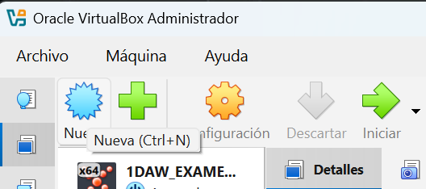

Oracle indica que desde el asistente de creación podemos especificar el nombre de la máquina virtual, la carpeta donde se almacenará, la ISO, la memoria, los procesadores y el disco virtual.

---

## 4.1. Nombre de la máquina virtual

En el campo **Nombre** escribimos:

```text
WS2025-SERVIDOR
```

Podemos utilizar otro nombre, pero es importante utilizar un nombre identificativo.

Por ejemplo:

```text
WS2025-SERVIDOR
```

o:

```text
SERVIDOR-WINDOWS-2025
```
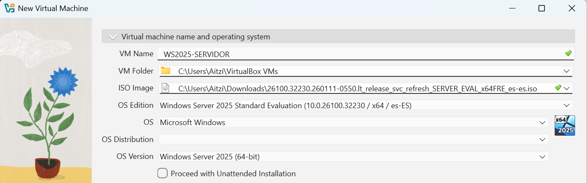


---

# 5. Seleccionar la ISO

En el apartado correspondiente a la imagen ISO seleccionamos la ISO de Windows Server 2025.

Por ejemplo:

```text
Windows_Server_2025_es-es_x64.iso
```

La ISO debe corresponder a la versión de Windows Server que vamos a instalar.

VirtualBox puede detectar automáticamente el sistema operativo contenido en la ISO.

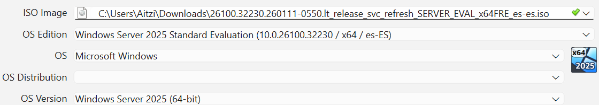

---

# 6. Instalación desatendida

VirtualBox 7.2 puede ofrecer una instalación desatendida.

Para esta práctica **no utilizaremos la instalación desatendida**.

Queremos realizar manualmente todos los pasos de instalación para conocer el proceso.

Si aparece la opción:

**Instalación desatendida / Unattended Installation**

seleccionaremos la opción que permita realizar la instalación manualmente.


---

# 7. Configurar la memoria RAM

Asignamos:

```text
4096 MB
```

Es decir:

**4 GB de RAM**

Esta cantidad es adecuada para nuestra práctica con Windows Server 2025 y Experiencia de escritorio.

Microsoft recomienda 4 GB para esta opción de instalación.

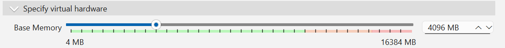

---

# 8. Configurar los procesadores

Asignaremos:

```text
2 CPU
```

Debemos evitar asignar todos los procesadores disponibles del ordenador físico a la máquina virtual.

El ordenador físico necesita conservar recursos para ejecutar:

* Windows/Linux del equipo anfitrión.
* VirtualBox.
* La máquina virtual.
* Otros programas que estén funcionando.


---

# 9. Crear el disco duro virtual

Creamos un nuevo disco duro virtual.

Configuración recomendada:

```text
Tamaño: 60 GB
```

Utilizaremos un disco virtual, no modificaremos directamente el disco duro físico del ordenador.

### Tipo de archivo

Podemos utilizar:

```text
VDI
```

que es el formato nativo de VirtualBox.

### Almacenamiento

Seleccionaremos:

```text
Reservado dinámicamente
```

si esta opción aparece en la versión/interfaz utilizada.

Esto permite que el archivo del disco virtual vaya creciendo a medida que el sistema operativo necesita espacio.

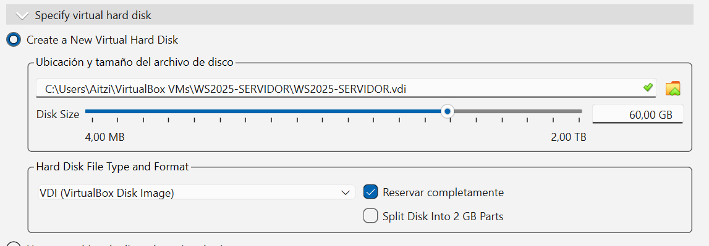

---

# 10. Resumen de la máquina virtual

Antes de terminar el asistente debemos comprobar la configuración.

Nuestra máquina debería tener aproximadamente:

| Parámetro | Valor                       |
| --------- | --------------------------- |
| Nombre    | WS2025-SERVIDOR             |
| Sistema   | Windows Server 2025         |
| RAM       | 4096 MB                     |
| CPU       | 2                           |
| Disco     | 60 GB                       |
| ISO       | Windows Server 2025 Español |
| Red       | NAT                         |

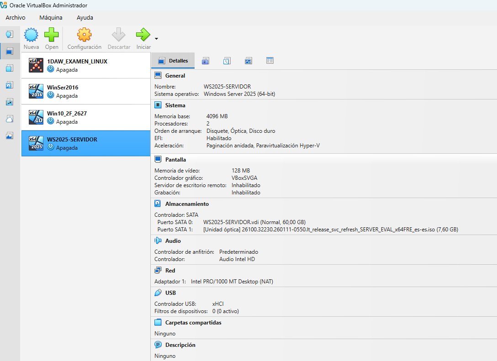

---

# 11. Revisar la configuración de la máquina virtual

Una vez creada la máquina virtual, **todavía no la iniciamos**.

Seleccionamos:

**WS2025-SERVIDOR → Configuración**

Vamos a revisar cada apartado.

---

# 12. Configuración del sistema

Entramos en:

**Configuración → Sistema**

## 12.1. Placa base

Comprobamos:

* Memoria RAM: **4096 MB**
* Orden de arranque.
* Disco óptico.
* Disco duro.

Si utilizamos UEFI, comprobaremos también la configuración correspondiente.

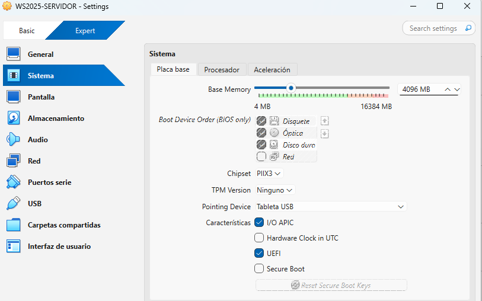

---

# 13. Sistema → Procesador

Entramos en:

**Configuración → Sistema → Procesador**

Configuramos:

```text
Procesadores: 2
```
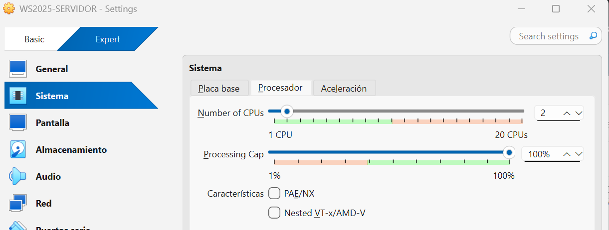

---

# 14. Almacenamiento

Entramos en:

**Configuración → Almacenamiento**

Aquí debemos comprobar que tenemos:

* El disco duro virtual.
* La unidad óptica.
* La ISO de Windows Server 2025.

La ISO funcionará como si hubiéramos introducido un DVD de instalación en un ordenador físico.

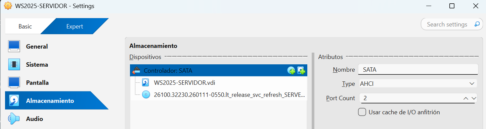

---

# 15. Configuración de red

Entramos en:

**Configuración → Red → Adaptador 1**

Activamos:

```text
Habilitar adaptador de red
```

Para la primera fase utilizaremos:

```text
Conectado a: NAT
```

VirtualBox utiliza NAT como configuración de red predeterminada para las máquinas virtuales nuevas y permite que el sistema invitado acceda a la red utilizando la conexión del equipo anfitrión.

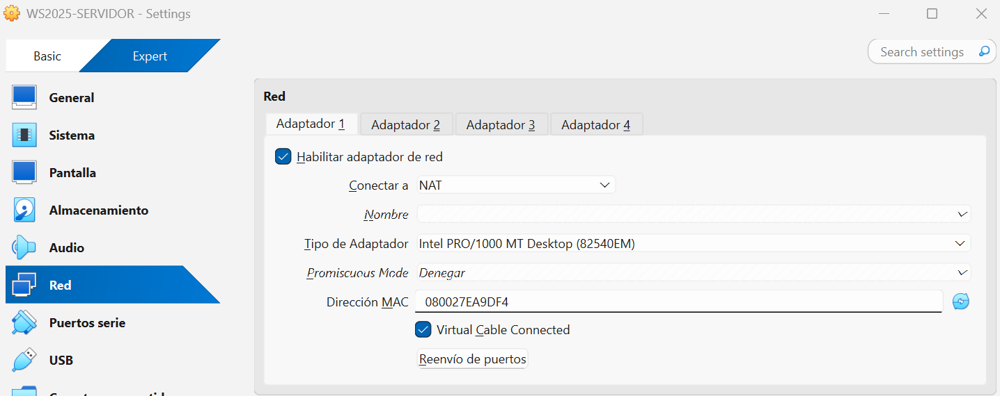

> Debe verse:
>
> * Adaptador habilitado.
> * NAT seleccionado.
> * Adaptador virtual utilizado.

---

# 16. Iniciar la máquina virtual

Una vez comprobada toda la configuración:

**Seleccionamos la máquina virtual → Iniciar**

La máquina virtual arrancará desde la ISO de Windows Server 2025.

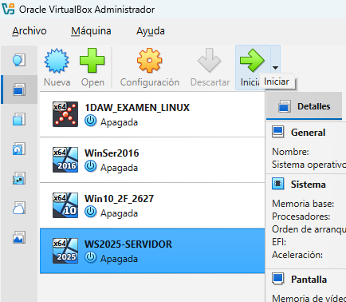


---

# 17. Instalación de Windows Server 2025

Después de iniciar la máquina aparecerá el asistente de instalación de Windows Server.

---

## 17.1. Idioma

Seleccionamos:

**Idioma que se va a instalar:**

```text
Español
```

---

## 17.2. Formato de hora y moneda

Seleccionamos:

```text
Español (España)
```

---

## 17.3. Teclado

Seleccionamos:

```text
Español
```

Comprobamos que el teclado corresponde al utilizado físicamente.

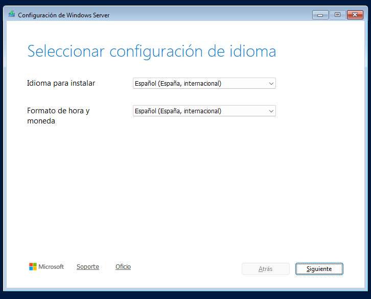
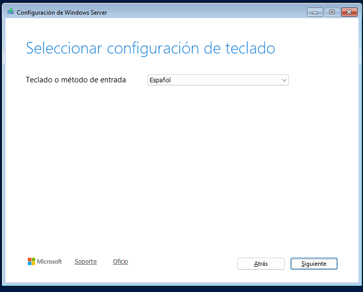

---

# 18. Iniciar la instalación

Seleccionamos:

**Instalar ahora**

Windows comenzará el proceso de instalación.

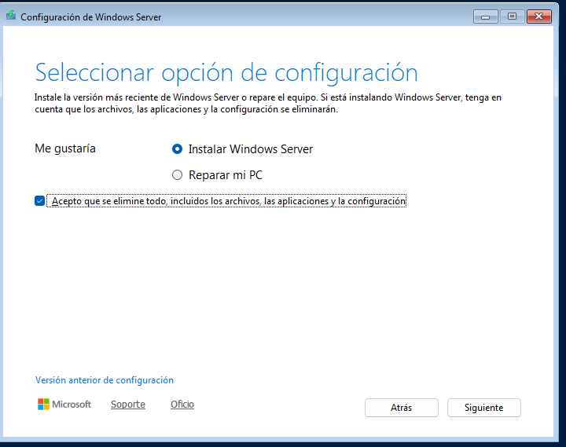

---

# 19. Seleccionar la edición

El instalador mostrará las diferentes opciones disponibles en la ISO.

Para esta práctica seleccionaremos:

```text
Windows Server 2025 Standard con experiencia de escritorio
```

> **MUY IMPORTANTE**
>
> No debemos seleccionar simplemente:
>
> `Windows Server 2025 Standard`
>
> si queremos utilizar interfaz gráfica.
>
> Debemos seleccionar:
>
> **Windows Server 2025 Standard con experiencia de escritorio**

Windows Server ofrece dos opciones principales de instalación: **Server Core** y **Servidor con experiencia de escritorio**. Server Core no incluye la interfaz gráfica estándar, mientras que Experiencia de escritorio sí la incluye.

Además, Microsoft indica que posteriormente no podemos convertir una instalación de Server Core en Experiencia de escritorio mediante un simple cambio de configuración; sería necesario realizar una instalación limpia.

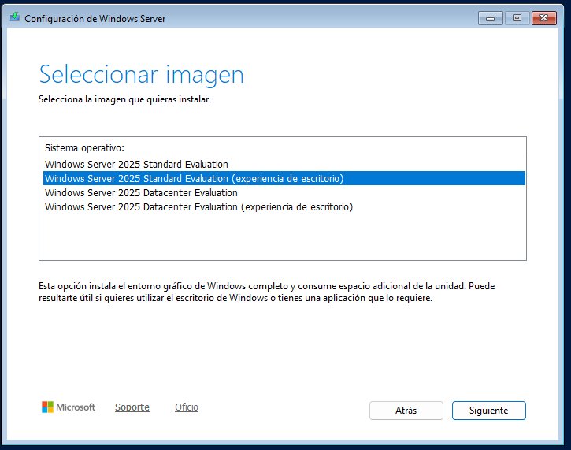

---

# 20. Aceptar la licencia

Leemos las condiciones de licencia.

Marcamos:

```text
Acepto los términos de licencia
```

y pulsamos:

**Siguiente**

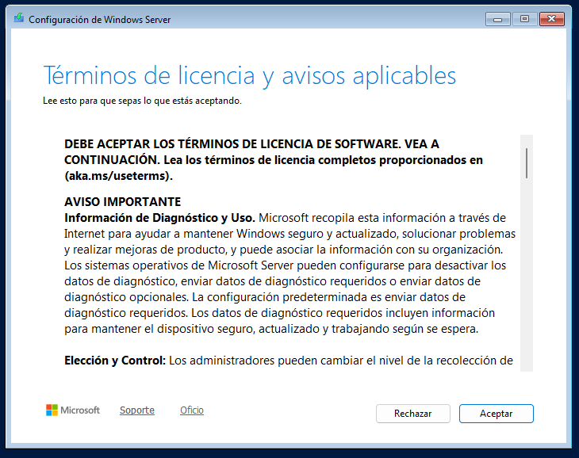

---

# 21. Tipo de instalación

El instalador nos preguntará qué tipo de instalación queremos realizar.

Como estamos instalando un servidor nuevo en una máquina virtual vacía, seleccionaremos:

**Personalizada: instalar solo Windows**

No realizaremos una actualización.

---

# 22. Seleccionar el disco de instalación

El instalador mostrará el disco virtual que hemos creado anteriormente.

Por ejemplo:

```text
Unidad 0
60 GB
Espacio sin asignar
```

Seleccionamos el disco y pulsamos:

**Siguiente**

Windows creará automáticamente las particiones necesarias.

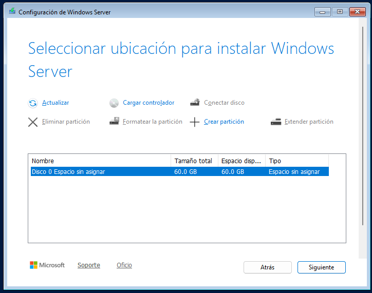

---

# 23. Comienza la instalación

Windows copiará los archivos y realizará la instalación.

Durante este proceso la máquina virtual se reiniciará varias veces.

**No debemos apagar la máquina virtual.**

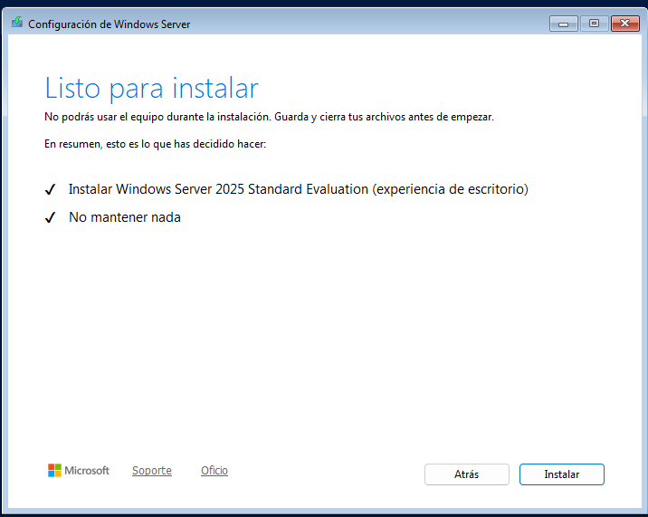
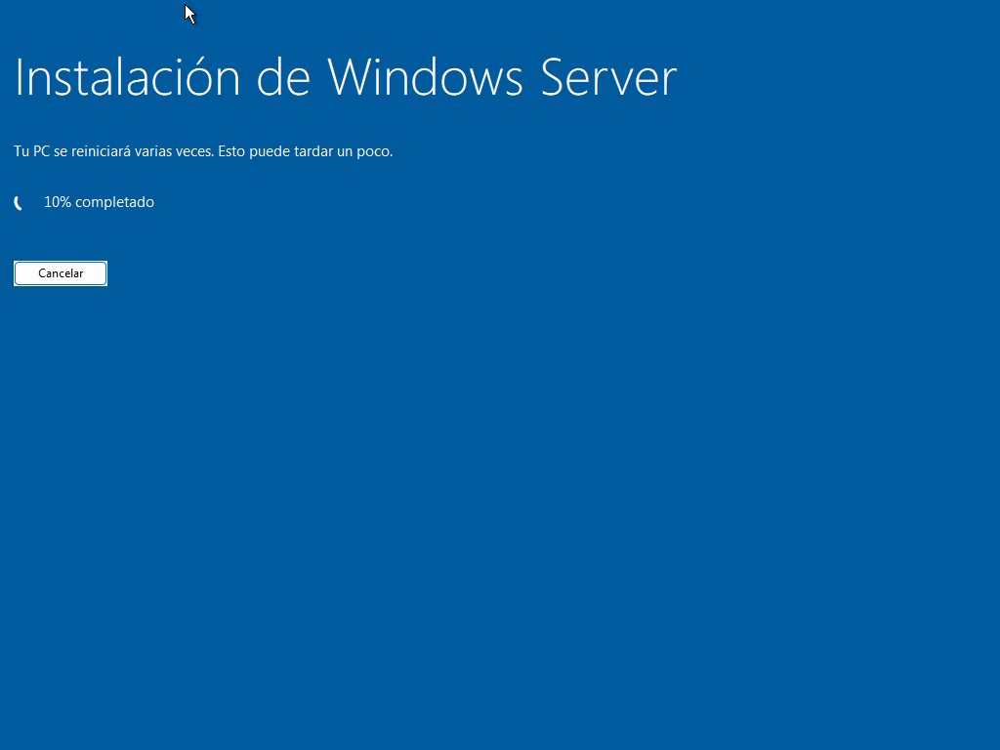

---

# 24. Configurar la contraseña del administrador

Una vez finalizada la instalación, Windows solicitará establecer la contraseña de la cuenta:

```text
Administrador
```

Debemos utilizar una contraseña segura.

Por ejemplo, para una práctica podemos utilizar una contraseña definida por el profesor.

**No utilizar contraseñas reales o personales.**

La contraseña debe contener una combinación adecuada de:

* Mayúsculas.
* Minúsculas.
* Números.
* Símbolos.

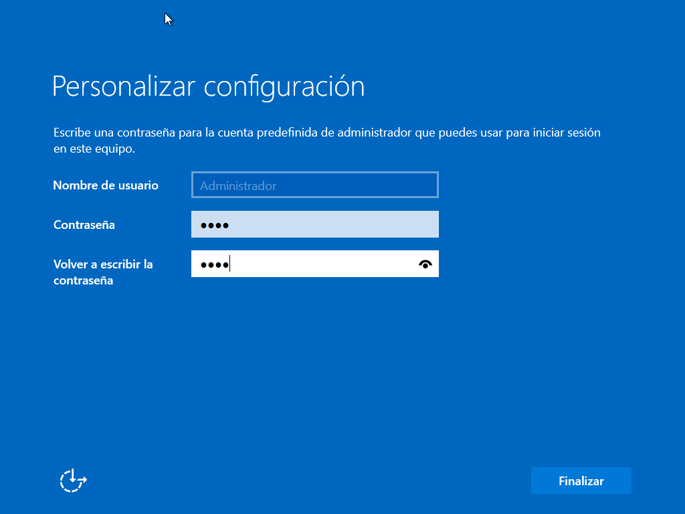

---

# 25. Primer inicio de sesión

Aparecerá la pantalla de inicio de sesión.

Introducimos:

```text
Usuario:
Administrador
```

y la contraseña configurada anteriormente.

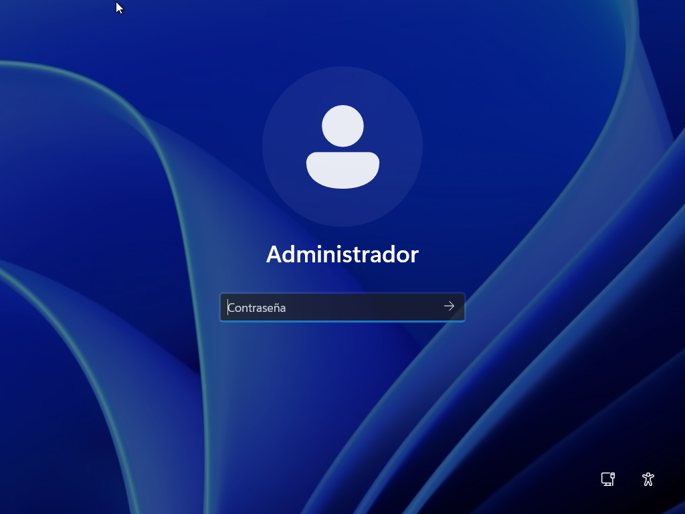

---

# 26. Escritorio de Windows Server

Una vez iniciada la sesión aparecerá el escritorio de Windows Server.

En una instalación con **Experiencia de escritorio** tendremos una interfaz gráfica completa.

También podremos disponer de:

* Administrador del servidor.
* Explorador de archivos.
* PowerShell.
* Símbolo del sistema.
* Herramientas administrativas.

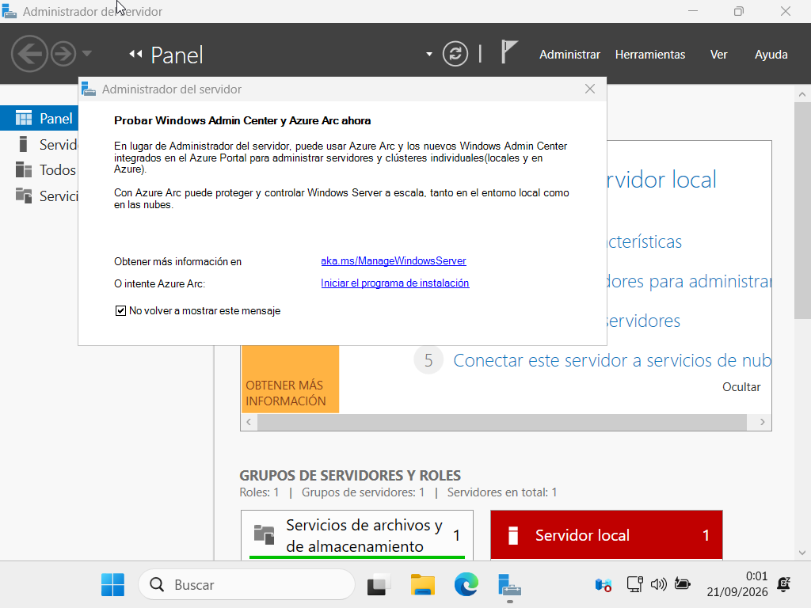
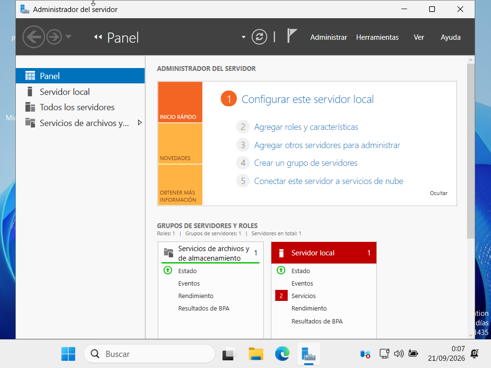

---

# 27. Comprobar el nombre del servidor

Una de las primeras tareas será comprobar el nombre del equipo.

Abrimos:

**Administrador del servidor**

y buscamos:

**Servidor local**

Comprobaremos el nombre actual del equipo.

Inicialmente puede tener un nombre generado automáticamente por Windows.

---

# 28. Cambiar el nombre del servidor

Utilizaremos un nombre identificativo.

Por ejemplo:

```text
SRV-WIN2025
```

o:

```text
SRV2025
```

En nuestro laboratorio utilizaremos:

```text
SRV-WIN2025
```

El nombre debe ser sencillo y no contener espacios.

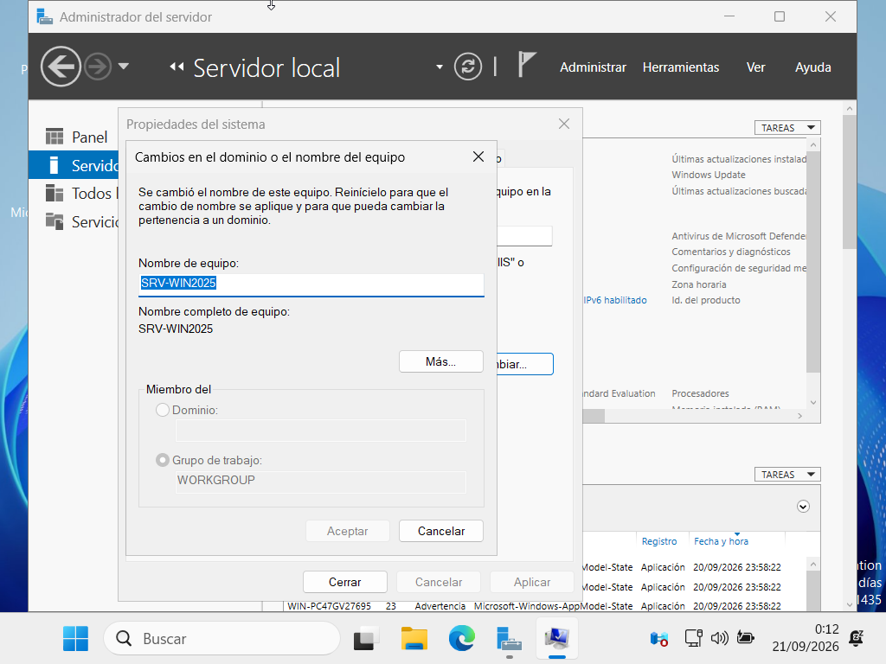

---

# 29. Reiniciar el servidor

Después de modificar el nombre será necesario reiniciar el servidor.

Seleccionamos:

**Reiniciar**

Después del reinicio volvemos a iniciar sesión.

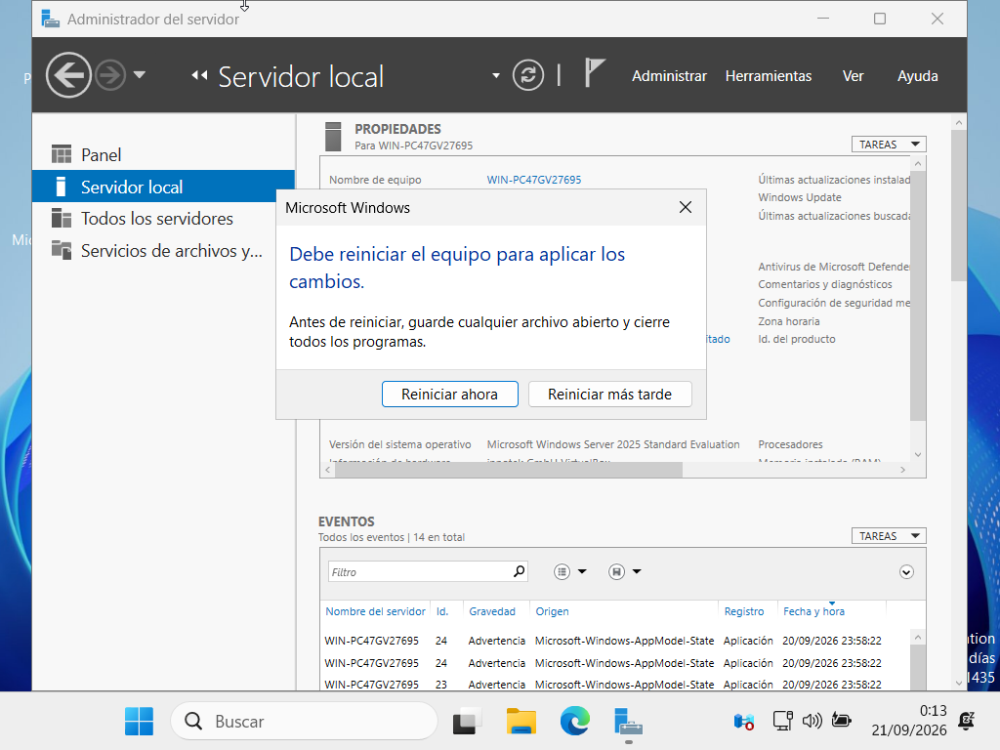
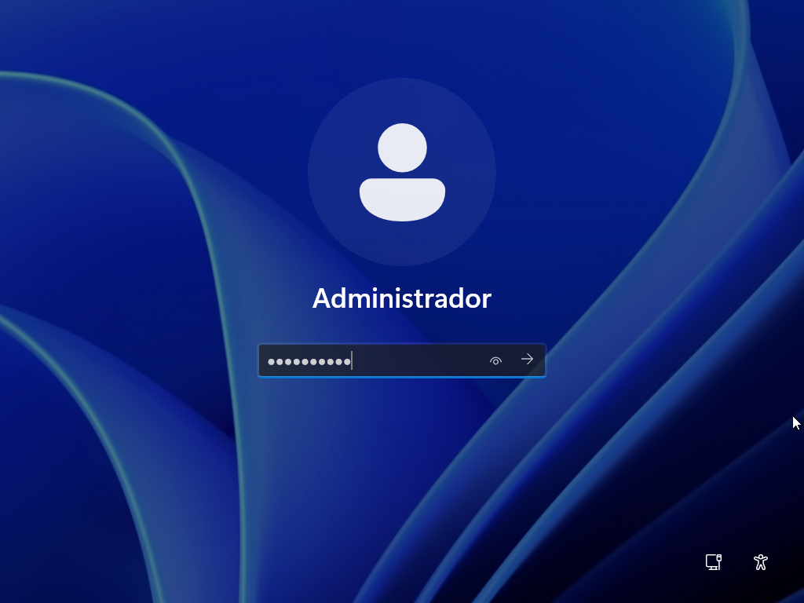

---

# 30. Comprobar la configuración de red

Abrimos una consola:

```text
PowerShell
```

Podemos utilizar:

```powershell
ipconfig
```

El comando mostrará la configuración de red.

Comprobamos que la máquina virtual tiene una dirección IP.

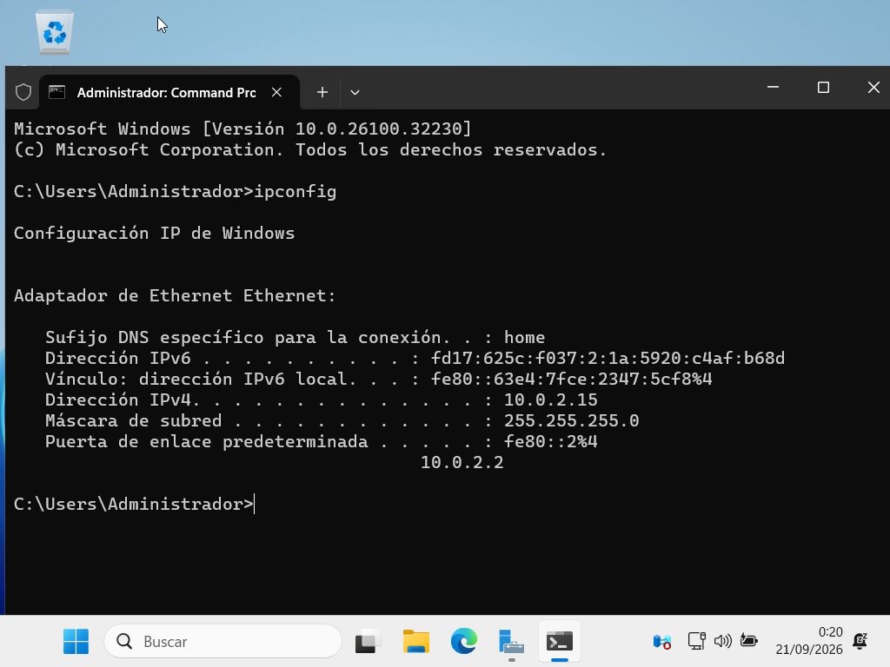

> Debe verse:
>
> * Dirección IPv4.
> * Máscara de subred.
> * Puerta de enlace.

---

# 31. Comprobar la conexión de red

Desde PowerShell podemos realizar una prueba utilizando:

```powershell
ping 8.8.8.8
```

Si recibimos respuestas, tenemos conectividad IP hacia Internet.

También podemos probar la resolución de nombres:

```powershell
ping www.microsoft.com
```

Si funciona, además de conectividad IP tenemos resolución DNS.
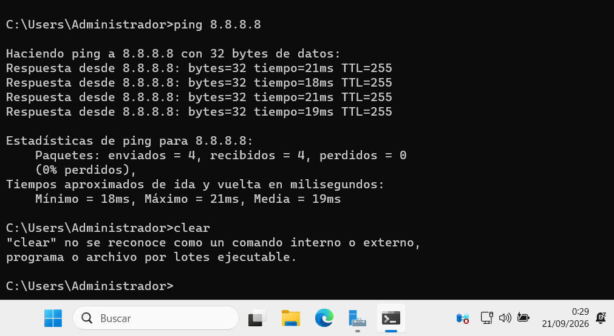

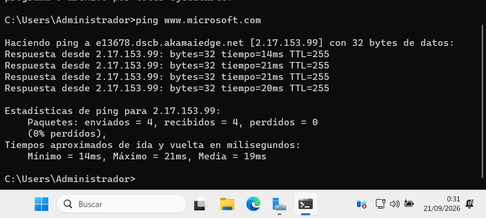

---

# 32. Comprobar la fecha y hora

Es importante que un servidor tenga correctamente configurada la fecha y la hora.

Comprobamos:

* Fecha.
* Hora.
* Zona horaria.

Para nuestro entorno:

```text
España
```

Una configuración correcta de hora será especialmente importante posteriormente cuando trabajemos con **dominios y Active Directory**.

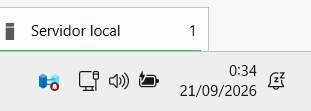

---

# 33. Buscar actualizaciones

Abrimos:

**Configuración → Windows Update**

y seleccionamos:

**Buscar actualizaciones**

Instalaremos las actualizaciones disponibles.

Microsoft recomienda ejecutar Windows Update después de instalar Windows Server 2025.

### 📸 CAPTURA 28 — Windows Update

> **INSERTAR AQUÍ CAPTURA**

---

# 34. Comprobar el Administrador del servidor

Abrimos:

**Administrador del servidor**

Debemos comprobar que el servidor aparece correctamente.

En este punto todavía no es necesario instalar todos los roles.

Posteriormente instalaremos los roles que necesitemos para nuestro proyecto.

Por ejemplo:

* Active Directory Domain Services.
* DNS.
* DHCP.
* Servicios de archivos.

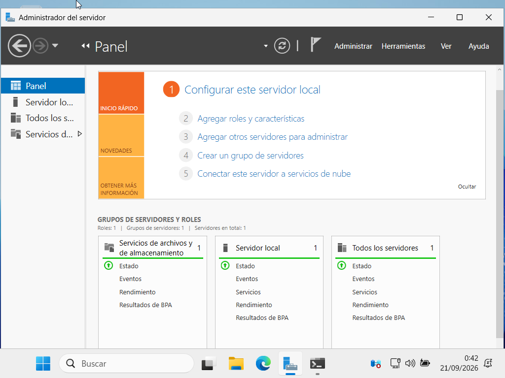

---

# 35. Configuración básica del servidor

Antes de comenzar con la configuración avanzada debemos comprobar:

| Comprobación                            | Estado |
| --------------------------------------- | :----: |
| Windows Server instalado                |    ☐   |
| Edición Standard                        |    ☐   |
| Experiencia de escritorio instalada     |    ☐   |
| Nombre del servidor configurado         |    ☐   |
| Contraseña de Administrador configurada |    ☐   |
| Adaptador de red funcionando            |    ☐   |
| Dirección IP obtenida                   |    ☐   |
| Conectividad comprobada                 |    ☐   |
| DNS comprobado                          |    ☐   |
| Fecha y hora correctas                  |    ☐   |
| Windows Update ejecutado                |    ☐   |
| Administrador del servidor funcionando  |    ☐   |

---

# 36. Configuración de una dirección IP estática

> **Esta configuración se realizará cuando preparemos el servidor para trabajar como servidor de red/dominio.**

Un servidor que vaya a proporcionar servicios de red debe tener una dirección IP conocida y estable.

En nuestro laboratorio podremos utilizar, por ejemplo:

```text
Dirección IP:       192.168.100.10
Máscara:            255.255.255.0
Puerta de enlace:   192.168.100.1
DNS preferido:      192.168.100.10
```

> **ATENCIÓN**
>
> Estos valores son únicamente un ejemplo. En una práctica real debemos utilizar el direccionamiento definido para nuestro laboratorio.

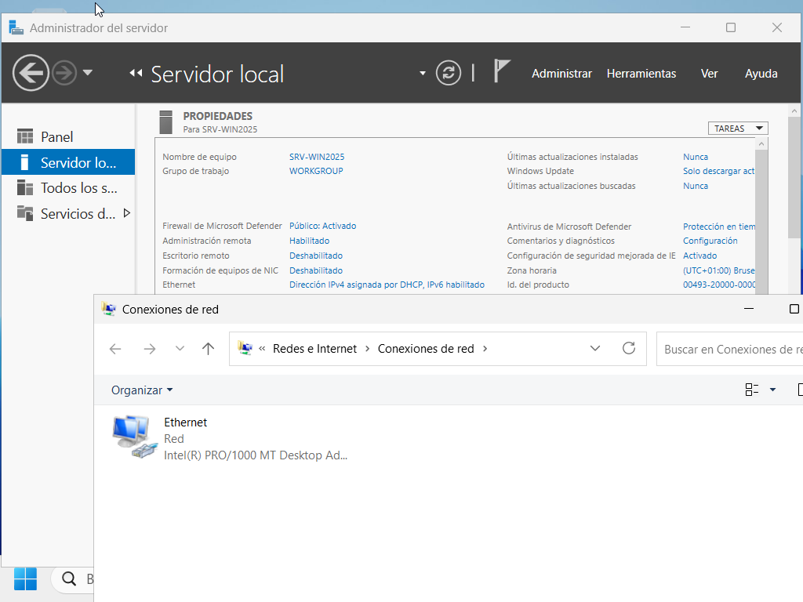

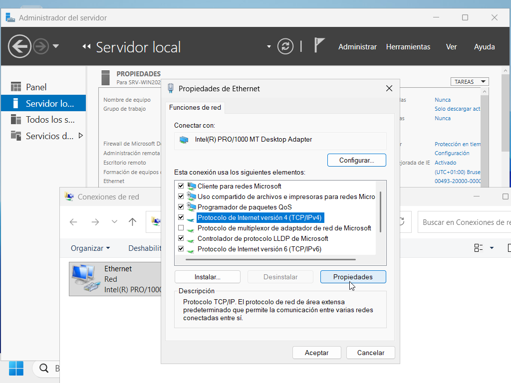

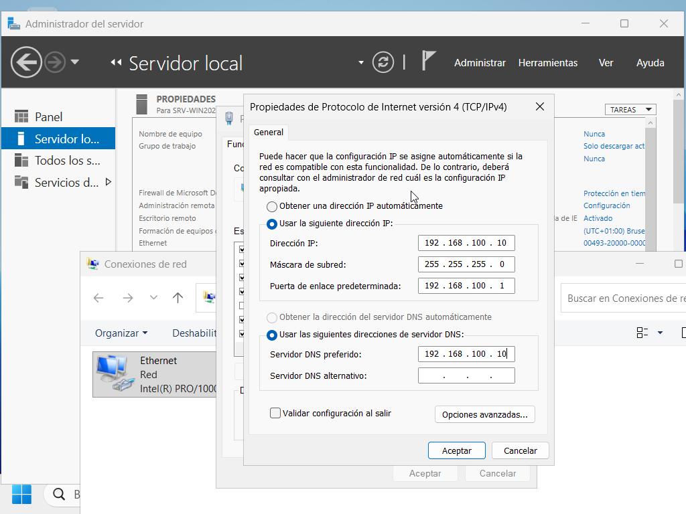

---

# 37. Comprobar nuevamente la red

Después de configurar la dirección IP estática ejecutaremos:

```powershell
ipconfig
```

Comprobaremos que aparece la configuración introducida.

Después podemos realizar:

```powershell
ping 192.168.100.10
```

El servidor debería responder a su propia dirección IP.

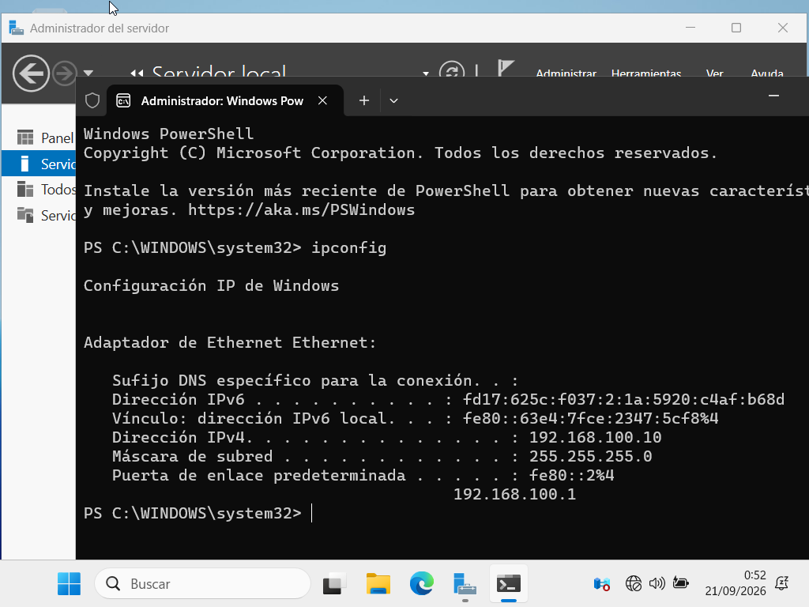

---

# 38. Crear una instantánea

Una vez terminada la instalación y configuración básica, es recomendable crear una **instantánea de la máquina virtual**.

La instantánea nos permitirá disponer de un punto de recuperación antes de comenzar a instalar y configurar servicios más complejos.

Por ejemplo:

```text
Estado inicial - Windows Server 2025
```

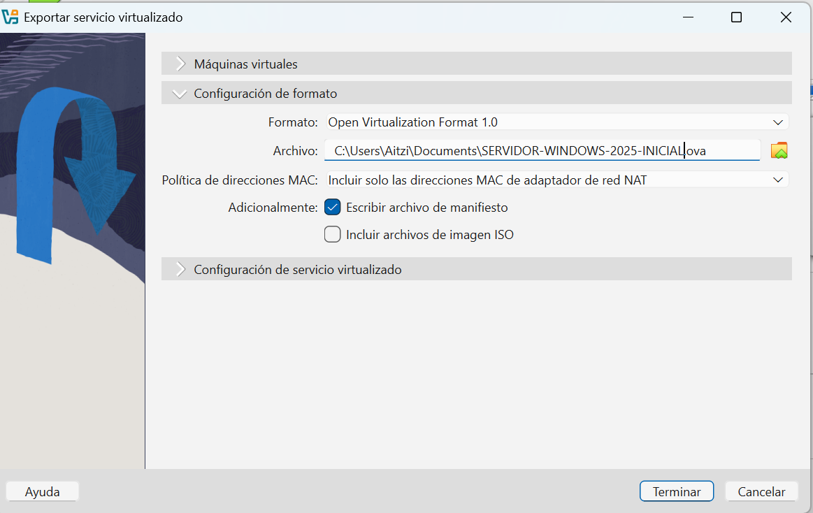
### 📸 CAPTURA 32 — Instantánea

> **INSERTAR AQUÍ CAPTURA**
>
> Mostrar la instantánea creada en VirtualBox.

---

# 39. Estado final de la máquina

Al finalizar esta práctica debemos tener:

```text
                    EQUIPO FÍSICO
                         │
                         │
                    VirtualBox 7.2
                         │
                         ▼
                ┌─────────────────┐
                │  WS2025-SERVIDOR│
                │                 │
                │ Windows Server  │
                │     2025        │
                │                 │
                │ Standard        │
                │ Desktop         │
                │ Experience      │
                └────────┬────────┘
                         │
                         ▼
                    Red virtual
                         │
                         ▼
                    Internet
```

La máquina virtual está ahora preparada para comenzar la siguiente fase del proyecto.

---

# 40. Evidencias que debes entregar

La instalación debe quedar documentada mediante capturas.

Como mínimo debemos disponer de evidencias de:

1. Creación de la máquina virtual.
2. ISO seleccionada.
3. Memoria RAM.
4. Procesadores.
5. Disco virtual.
6. Configuración de almacenamiento.
7. Configuración de red.
8. Idioma de Windows.
9. Edición de Windows Server seleccionada.
10. Tipo de instalación.
11. Disco seleccionado.
12. Proceso de instalación.
13. Configuración de la contraseña de Administrador.
14. Escritorio de Windows Server.
15. Nombre del servidor.
16. Configuración IP.
17. Pruebas de conectividad.
18. Windows Update.
19. Administrador del servidor.
20. Instantánea final.

> **Importante:** cuando hagas las capturas, evita mostrar contraseñas, claves de producto u otra información que no sea necesaria para demostrar el ejercicio.

---

# 41. Problemas habituales

## La máquina virtual no arranca desde la ISO

Comprobar:

* Que la ISO está correctamente seleccionada.
* Que aparece en **Configuración → Almacenamiento**.
* Que la unidad óptica está habilitada.
* Que la máquina virtual está apagada antes de modificar la configuración.

---

## La instalación se queda bloqueada

Comprobar:

* Memoria RAM asignada.
* Número de procesadores.
* Espacio disponible en el disco.
* Integridad de la ISO.

Microsoft advierte específicamente de problemas al instalar Windows Server 2025 en una máquina virtual con recursos de memoria mínimos.

---

## Windows Server no tiene conexión a Internet

Comprobar:

1. Que la máquina virtual está apagada o correctamente configurada.
2. **Configuración → Red**.
3. Que el adaptador está habilitado.
4. Que está seleccionado **NAT** para esta primera fase.
5. Ejecutar:

```powershell
ipconfig
```

y posteriormente:

```powershell
ping 8.8.8.8
```

---

## No aparece interfaz gráfica

Probablemente se ha instalado:

```text
Windows Server 2025 Standard
```

en lugar de:

```text
Windows Server 2025 Standard con experiencia de escritorio
```

Server Core no incluye la interfaz gráfica estándar. En Windows Server 2025 no podemos cambiar posteriormente entre Server Core y Experiencia de escritorio sin realizar una instalación limpia.

---

# 42. Checklist final

Antes de dar la práctica por terminada, comprueba:

### Máquina virtual

* [ ] Máquina virtual creada.
* [ ] Nombre correcto.
* [ ] 4 GB de RAM.
* [ ] 2 procesadores.
* [ ] Disco virtual de 60 GB.
* [ ] ISO de Windows Server 2025.
* [ ] Adaptador de red habilitado.
* [ ] NAT configurado.

### Windows Server

* [ ] Windows Server 2025 instalado.
* [ ] Idioma español.
* [ ] Windows Server Standard.
* [ ] Experiencia de escritorio.
* [ ] Contraseña de Administrador configurada.
* [ ] Nombre del servidor configurado.
* [ ] Red funcionando.
* [ ] Conectividad comprobada.
* [ ] Fecha y hora correctas.
* [ ] Actualizaciones realizadas.

### Documentación

* [ ] Capturas realizadas.
* [ ] Capturas ordenadas.
* [ ] Cada captura tiene una explicación.
* [ ] No aparecen contraseñas.
* [ ] No aparecen claves de producto.
* [ ] Se puede reproducir la instalación siguiendo la documentación.

---

# 43. Resultado esperado

Al terminar esta guía tendremos un **Windows Server 2025 virtualizado y preparado para trabajar como servidor de nuestra infraestructura**.

El siguiente paso será comenzar a convertir esta instalación básica en un servidor de red:

```text
Windows Server 2025
        │
        ├── Configuración de red
        │
        ├── DNS
        │
        ├── Active Directory
        │
        ├── Dominio
        │
        ├── Usuarios
        │
        ├── Grupos
        │
        ├── Equipos cliente
        │
        └── Recursos compartidos
```

La instalación del sistema operativo es solamente el **primer paso**. A partir de aquí comenzaremos a construir la infraestructura de nuestra empresa.

---

## Fuentes de referencia

* Oracle VirtualBox 7.2 — Manual de usuario.
* Microsoft Learn — Requisitos de hardware de Windows Server 2025.
* Microsoft Learn — Opciones Server Core y Experiencia de escritorio.
* Microsoft — Centro de evaluación de Windows Server 2025.
* Microsoft Learn — Instalación de Windows Server desde medios de instalación.
